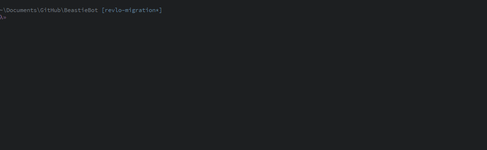

# teamTALIMA's Beastie Bot
*teamTALIMA Project &mdash; [Developed LIVE on twitch.tv/teamTALIMA](https://www.twitch.tv/teamtalima)*

> teamTALIMA's personal BeastieBot, trained to watch over Twitch chatrooms and (soon) Discord servers

 ## Contents

  - [Features](#features)
    - [Upcoming Features](#upcoming-features)
  - [Prerequisites](#prerequisites)
  - [Installation](#installation) 
    - [Troubleshooting](#troubleshooting)
  - [License](#license) 

## Features

Some of Beastie's main features include...

  - **Commands**
    - For viewers
      - `!helpbeastie` Prints all available commands
      - `!hellobeastie` Says hello to you
      - `!goodbyebeastie` Says goodbye to you
      - `!rawr` Rawrs in the chat
      - `!pet` Pets Beastie on the head
      - `!awesomeness` Tells you how much awesomeness you have
      - `!uptime` Tells you how long the stream has been running
      - `!raidready` Joins you into the active chat raid team, if there is one
      - `!loyalty` A hidden command that tells you about the loyalty points
      - `!<stream info>` Tells you about `<stream info>` &mdash; Configurable by the broadcaster in the [settings.ini]
      - `!<custom command trigger>` Tells you about `<custom command trigger>` if it's set up as a custom command
    - For moderators
      - `!shoutout <channel>` Gives a shoutout to an awesome channel
      - `!awesomeness <teammate>` Tells you how much awesomeness `<teammate>` has
      - `!raidteam` Tells you how many teammates have joined the raid team & explains how to join
      - `!strawpoll <poll title>|<answer 1>|<answer N...>` Creates a Straw Poll, titled `<poll title>`, with `<answer 1>` through `<answer N>` as choices in the poll
      - `!commands add <trigger> <message...>` Creates a custom command `!<trigger>` that replies with `<message>`
      - `!commands overwrite <trigger> <message...>` Overwrites a custom command `!<trigger>` so that it replies with `<message>`
      - `!commands delete <trigger>` Deletes the custom command `!<trigger>`
      - `!commands custom` Tells you the commands that are custom
    - For the broadcaster
      - `!bonusall <amount>` Gives everyone bonus awesomeness
      - `!bonus <teammate> <amount>` Gives `<teammate>` bonus awesomeness
      - `!raidstart` Starts the process for a chat raid and tells everyone how to join
      - `!raidstop` Stops an active raid
      - `!timers` Tells you all current timers
      - `!timers <disable|enable> <timer>` disables or enables `<timer>`
      - `!deliberatecrash` A hidden debugging command that deliberately crashes Beastie -- useful for quickly reloading him.
      - `!follows` A hidden comand that tells you how many new followers Beastie has seen since he started up.
  - **Events**
    - New follows - New followers are welcomed to the stream.
    - Hosts by other channels - Announces that another channel has hosted the broadcaster if their viewer count exceeds [settings.ini]'s `announce.hosted.threshold`
  - **Custom Timers** - Set of customizable timers which are configurable in the [settings.ini]
  - **Support for importing points from Revlo**
    - Simply move your `<username>_points.csv` file that revlo gave you into the `data/` directory in the root of the BeastieBot project and rename it to `points.csv`. Voila!
      - *Note: `data/` may need to be created if you've never run Beastie before*

### Upcoming Features

These features are soon to be developed, either on stream or merged from collaborating teammate branch

  - **Twitch Chat Logs** - A system to record/log all twitch chat from the broadcaster's chatroom
  - **Twitch Chat Moderation** - Beastie moderation for purges, timeouts, and bans based off a customizable blacklist
  - **Beastie Treats** - BeastieBot's personal currency, used to unlock special commands, perks, and surprises
  - **Discord Support** - All of the great things beastie can do in the Twitch chat room, he will do on your Discord server.

## Prerequisites

  1. [Node.js (**Latest**)](https://nodejs.org/en/download/current) &mdash; Instructions for installing via your [OS's package manager are also available](https://nodejs.org/en/download/package-manager/).

## Installation

  1. Clone or [Download](https://api.github.com/repos/teamtalima/beastiebot/zipball) the repository and `cd` into it. 
    `git clone https://github.com/teamTALIMA/BeastieBot && cd BeastieBot`
  2. Run `npm i` to install Beastie's NPM dependencies
  3. Optionally run `npm link` to add a `beastie` command to your path. *(use `node .` or `node ./src/cli.js` in place of `beastie` in the process below)*
  4. Run `beastie init` and provide your Client-ID, Broadcaster's OAuth and Bot's OAuth per the interactive prompts.
      - [*"Where can I get a Client-ID?"*](https://www.twitch.tv/kraken/oauth2/clients/new)
      - [*"Where do I get an OAuth Token for my accounts?"*](https://twitchapps.com/tmi/)
  5. Run `beastie start` to start beastie *(or use `node ./src/monitor` to start the monitor directly)*
  6. You should be done! Go test him out!
  7. Optionally run `beastie status` to check the status or run `beastie stop` to stop any running instance of Beastie's monitor.

### Troubleshooting

> SyntaxError: Block-scoped declarations 

Nodejs is out of date, make sure you have the latest version of node installed.

## License
GNU GPLv3

-----------------

[settings.ini]: config/settings.ini